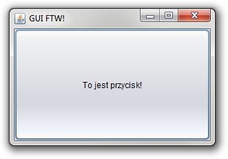

# Niech się stanie GUI FTW!

Lublin, 2011-03-20.

Ponieważ uwielbiam programowanie deklaratywne brakowało mi od dawna
czegoś deklaratywnego do tworzenia GUI. Kod tworzący GUI jest zawsze
bardzo nudny i powtarzalny: "stwórz obiekt, ustaw jego tekst, ikonę,
dodaj akcję na klik (wcześniej stwórz obiekt implementujący
odpowiedniego listenera), ew. stwórz obiekty-dzieci, bla bla bla".

Projektanci stron internetowych od początku mają do dyspozycji HTML i
CSS, które są jak najbardziej deklaratywne w swojej naturze. Dodatkowo
treść określa się osobno od tego jak ma wyglądać. Model ten zaczyna
wychodzić poza przeglądarki, np. XAML w .NET albo pliki layoutów w
Androidzie. Wszystkie znane mi do tej pory tego przykłady opierają się
na XML-u i dodatkowym programie generującym kod w trakcie kompilacji.

Ostatnio pracuję nad podobną biblioteką dla Clojure. Są jednak dwie
główne różnice:

1. Tak jak dla programistów Javy naturalnym językiem do opisu danych
   jest XML tak dla programistów Clojure tym językiem jest Clojure.
2. Moja biblioteka jest jedynie biblioteką, nie wymaga dodatkowych
   programów generujących (powiedzmy) kod Javy z XML-a.

Ad 1. Składnia Clojure to tylko struktury danych: listy, wektory i
mapy o *wybornej* składni. Grzechem byłoby używać w takiej sytuacji
XML-a. Całe parsowanie robi za mnie Clojure więc mogę martwić się już
tylko znaczeniem tego co siedzi w środku. Zarówno drzewo GUI (analogia
do HTML) jak i style (CSS) definiowane są za pomocą kodu w Clojure.

Ad 2. Dzięki magicznym technikom metaprogramowania (makrom) mogę
wchodzić w drogę kompilatorowi Clojure i generować kod tuż przed
kompilacją zamiast generować kod programem i dopiero potem wywoływać
kompilator. Dlatego całą funkcjonalność można spakować do pliku jar i
używać jak każdej innej biblioteki. Ułatwia to także programowanie
interaktywne z użyciem REPL.

## Co, gdzie, jak?

Teraz nieco więcej o samej bibliotece. Nazwałem ją **GUI FTW!** a pobrać
ją można stąd: <http://github.com/santamon/GUIFTW>. Jest dostępna
także na [Clojars](http://clojars.org/guiftw) więc wystarczy dodać
`[guiftw "0.1.0-SNAPSHOT"]` do zależności projektu aby jej
użyć. Polecam poeksperymentować z przykładami w katalogu
[src/guiftw/examples](http://github.com/santamon/GUIFTW/blob/master/src/guiftw/examples),
które są również mocno obkomentowane w formie tutoriala.

GUI FTW! nie jest kolejnym toolkitem obok SWT i Swinga -- jest
deklaratywną nakładką na nie. Tzn. GUI FTW! można używać do tworzenia
interfejsów używając jednego albo drugiego pod spodem. Do tego zostało
napisane na tyle abstrakcyjnie, że można łatwo dopisać obsługę
kolejnego toolkitu. Ułatwi to przesiadkę programistom Javy, którzy
znają jedno albo drugie. Poza tym, pisanie kolejnego toolkitu nie jest
po prostu celem tego projektu.

## Banalny przykład

Strukturą GUI jest drzewo, którego węzeł składa się z nazwy
klasy, listy właściwości oraz z jego węzłów-dzieci.

    (def window
     (swing
       [JFrame [:title "GUI FTW!"
                :visible true]
        [JButton [:text "To jest przycisk!"]]]))

Wewnątrz listy cech można używać dowolnych nazw, które mają swoje
settery w danej klasie. Np. `:title` tłumaczone jest na wywołanie
metody `setTitle`, `:default-close-operation` na
`setDefaultCloseOperation` itd.

Aby zdefiniować style osobno musimy nadać elementom identyfikatory:

    [JFrame [*id :okno-ftw]
     [JButton [*id :przycisk-omg]]]

a osobno w tzw. arkuszu stylów zdefiniować cechy obiektów:

    (def sheet
     (stylesheet
      [:okno-ftw] [:title "GUI FTW!"
                   :size ^unroll (300 200)
                   :visible true]
      [:przycisk-omg] [:text "To jest przycisk!"]))

Składnia styli składa się z par list: najpierw lista identyfikatorów,
druga lista jest listą właściwości jak poprzednio. `^unroll` jest
potrzebne dla setterów, które mają więcej niż jeden parametr. Lista
poprzedzona `^unroll` zostanie rozwinięta na wszystkie jego parametry
zamiast wywołać setter z listą jako parametrem. Czyli otrzymamy
odpowiednik <code>setSize(300, 200)</code> zamiast <code>setSize((300, 200))</code>.

Makro `swing` zwraca funkcję, która utworzy chciane GUI, więc `window`
będzie funkcją. Parametrami tej funkcji jest ew. obiekt nadrzędny
(jeśli nie tworzylibyśmy okna tylko jakiś podrzędny element, może być
nil) oraz dowolna ilość arkuszy styli. Utworzenie okna będzie więc
wyglądało tak:

    (window nil sheet)

Arkuszy może być więcej, możemy także podać inny komplet. Możemy też
utworzyć wiele okien wywołując powtórnie tę funkcję. Zwrócony zostanie
element na korzeniu drzewa.

Analogiczny przykład w SWT użyłby klas specyficznych dla SWT i przede
wszystkim makra `swt` zamiast `swing`.

## Co dalej

Zacząłem pisać dokumentację. Jest dostępna w kodzie bądź przez `doc` w
REPL-u. Przydałaby się też dokumentacja on-line w stylu [tej dla samego Clojure](http://clojure.github.com/clojure/).

W tym momencie można stworzyć GUI, ostylować go i podpiąć zdarzenia (o
czym będzie następny wpis). Brakuje całej części "stanowej", w
szczególności wyciąganie z drzewa interesujących nas elementów. Mam
również pomysł, by podpinać wartości (np. tekst pola tekstowego)
dwustronnie pod clojure'owe atomy, refy, agentów itp. Pozwoliłoby to
na spięcie GUI i np. pamięci transakcyjnej.
