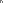

# Tracing pixels

London, 2014-08-20.

There are many reasons to use SVG: for sprites, fonts, vector
graphics, etc. Currently developers are not giving it enough credit
(we're catching up). The reason we'll be focusing here is somewhat
different. After some research [source!] and experimentation it turns
out it might be also the best way to serve pixel art. Why?  Because
all other options require either `<canvas>`+JavaScript hacks or don't
work in all browsers (CSS solutions).

This post describes a simple algorithm that [SharpVG] [sharpvg] uses
to trace pixel shapes.

## Intuition

Lets start with a simple shape. A pixelated letter "n". Then, we'll
trace it using our, well, intuition. [Figure 1](#fig1) is showing the
very simple pixelated representation of the letter. If we start from left top corner `0,0` and start moving clockwise, the trace will look like on the [figure 2](#fig2).

<figure id="fig1" class="center">
  <object data="tracing-pixels-images/n-big.svg" type="image/svg+xml">
    
  </object>

  <figcaption>
    fig. 1: Our hero: pixelated letter "n".
  </figcaption>
</figure>

<figure id="fig2" class="center">
  <object data="tracing-pixels-images/steps.svg"
          type="image/svg+xml">
    
  </object>

  <figcaption>
    fig. 2: Steps of going around the letter "n".
  </figcaption>
</figure>

Lets now list the steps and encode them with the moves they represent
([fig. 3](#fig3)). Horizontal moves will be represented with letter
`h` and vertical with `v`. Each move is one step in either direction
so it will have value either 1 or -1. Given that `0,0` is in the top
left corner, `h1` means right, `h-1` is left, `v1` means down and
`v-1` is up.

<figure id="fig3" class="center">
  <svg width="27" height="40">
    <use xlink:href="tracing-pixels-images/moves.svg#move0001wl" />
  </svg>
  <svg width="27" height="40">
    <use xlink:href="tracing-pixels-images/moves.svg#move0011wl" />
  </svg>
  <svg width="27" height="40">
    <use xlink:href="tracing-pixels-images/moves.svg#move0010wl" />
  </svg>
  <svg width="27" height="40">
    <use xlink:href="tracing-pixels-images/moves.svg#move1001wl_right" />
  </svg>
  <svg width="27" height="40">
    <use xlink:href="tracing-pixels-images/moves.svg#move0010wl" />
  </svg>
  <svg width="27" height="40">
    <use xlink:href="tracing-pixels-images/moves.svg#move1010wl" />
  </svg>
  <svg width="27" height="40">
    <use xlink:href="tracing-pixels-images/moves.svg#move1000wl" />
  </svg>
  <svg width="27" height="40">
    <use xlink:href="tracing-pixels-images/moves.svg#move0100wl" />
  </svg>
  <svg width="27" height="40">
    <use xlink:href="tracing-pixels-images/moves.svg#move0101wl" />
  </svg>
  <svg width="27" height="40">
    <use xlink:href="tracing-pixels-images/moves.svg#move1001wl_left" />
  </svg>
  <svg width="27" height="40">
    <use xlink:href="tracing-pixels-images/moves.svg#move1110wl" />
  </svg>
  <svg width="27" height="40">
    <use xlink:href="tracing-pixels-images/moves.svg#move1010wl" />
  </svg>
  <svg width="27" height="40">
    <use xlink:href="tracing-pixels-images/moves.svg#move1000wl" />
  </svg>
  <svg width="27" height="40">
    <use xlink:href="tracing-pixels-images/moves.svg#move0100wl" />
  </svg>
  <svg width="27" height="40">
    <use xlink:href="tracing-pixels-images/moves.svg#move0101wl" />
  </svg>
  <svg width="27" height="40">
    <use xlink:href="tracing-pixels-images/moves.svg#move0101wl" />
  </svg>

  <figcaption>
    fig. 3: "n" traced, sorted
  </figcaption>
</figure>

This is exactly how we'd describe a path in SVG, using relative
movements (think [LOGO] [logo] but without rotation). We mark the
starting point with absolute "move there" command, in this case to
point `0,0` so in SVG it'll be `M 0 0`.

The full path looks like on [figure 4](#fig4).

<figure id="fig4">
  <code>M 0 0 h1 h1 v1 h1 v1 v1 h-1 v-1 v-1 h-1 v1 v1 h-1 v-1 v-1 v-1</code>

  <figcaption>
    fig. 4: The full uncompressed path for the letter "n".
  </figcaption>
</figure>

Path syntax is a little mini-language that's meant to live inside the
`d` attribute of `<path>` elements. So full SVG's source looks
like on [figure 5](#fig5) and the image itself is the [figure 6](#fig6).

<figure id="fig5">
  <pre><code>&lt;svg width="3" height="3"
     xmlns="http://www.w3.org/2000/svg"&gt;
  &lt;path d="M0 0h2v1h1v2h-1v-2h-1v2h-1z" fill="#777777"/&gt;
&lt;/svg&gt;</code></pre>

  <figcaption>
    fig. 5: Full SVG source.
  </figcaption>
</figure>

<figure id="fig6" class="center">
  

  <figcaption>
    fig. 6: The resulting SVG image (scaled up).
  </figcaption>
</figure>

You might notice that the path in the SVG image is a bit
different. [SharpVG] [sharpvg] is compressing the output by combining
neighbouring moves if they're the same, for example `h1 h1` will
become `h2` in the output.

<figure id="figx" class="center">
  <object data="tracing-pixels-images/moves.svg" type="image/svg+xml">
    
  </object>

  <figcaption>
    fig. X: Possible moves
  </figcaption>
</figure>

[sharpvg]: https://github.com/brainshave/sharpvg
[logo]: http://en.wikipedia.org/wiki/Logo_(programming_language)
